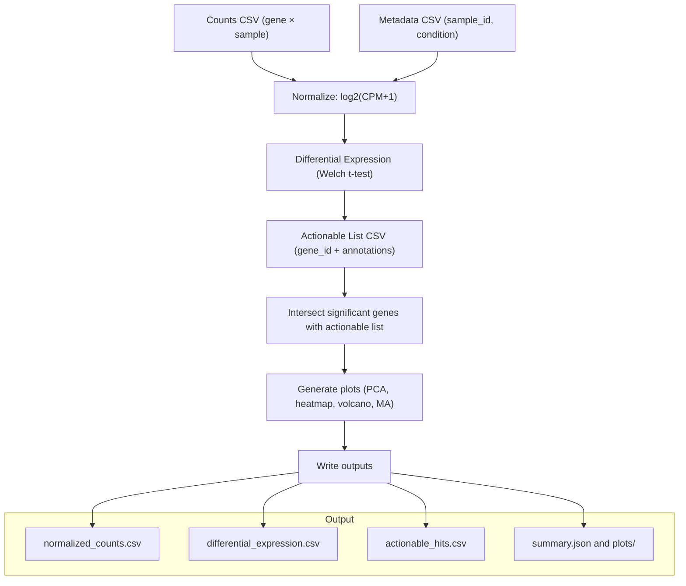

# CSV to Actionable Insights (demo)

A lightweight Nextflow pipeline showing how to transform a CSV-based cancer expression matrix into differential expression calls and actionable hits.

### Workflow at a glance



### TL;DR
- **Input:**  
  - Counts CSV (genes × samples, first column = `gene_id`)  
  - Metadata CSV (`sample_id`, `condition` with exactly two conditions)  
  - Actionable list CSV (`gene_id` + any extra annotations)  
  - Optional annotations table (`gene_id`, `gene_symbol`) to remap IDs to symbols

- **What the pipeline does:**  
  1. Normalises counts to log2(CPM+1).  
  2. Runs differential expression (Welch t-test) between the two conditions.  
  3. Intersects significant genes with your actionable list.  
  4. Writes summary stats and generates PCA, heatmap, volcano, and MA plots.

- **Output:**  
  - `preprocessed/normalized_counts.csv`  
  - `differential_expression.csv`  
  - `actionable_hits.csv`  
  - `summary.json`  
  - `plots/` (`pca_samples.png`, `heatmap_top_genes.png`, `volcano.png`, `ma_plot.png`)

- **What Nextflow does here:**  
  Nextflow just **glues the steps together and manages files**. It takes your inputs, runs the Python scripts in the right order (normalize → DE test → actionable filter → plots), passes the correct files between them, manages work directories, and lets you re-run the whole workflow with different inputs or profiles without manually chaining commands.
::contentReference[oaicite:0]{index=0}


## Layout
- `main.nf` – pipeline definition.
- `nextflow.config` – defaults and optional conda profile.
- `bin/` – helper scripts executed by processes.
- `data/raw/` – example gene counts + sample metadata.
- `data/reference/` – toy actionable gene list.
- `results/` – created on run; holds outputs.
- `results/plots/` – PCA, heatmap, volcano, and MA plots.

## Quickstart
1. Install Nextflow (https://www.nextflow.io/) and, optionally, `conda` or `mamba`.
2. Run with the bundled toy data:
   ```
   nextflow run main.nf -profile local
   ```
   Or create an isolated environment:
   ```
   nextflow run main.nf -profile conda
   ```
3. Outputs land in `results/`:
   - `preprocessed/normalized_counts.csv`
   - `differential_expression.csv`
   - `actionable_hits.csv`
   - `summary.json`
   - `plots/`:
     - `pca_samples.png`
     - `heatmap_top_genes.png`
     - `volcano.png`
     - `ma_plot.png`

## Customizing inputs
Pass your own files via params:
```
nextflow run main.nf \
  --counts path/to/gene_counts.csv \
  --metadata path/to/sample_metadata.csv \
  --actionable path/to/actionable_genes.csv \
  --annotations path/to/gene_annotations.tsv \
  --outdir my_results
```

Expected formats:
- Counts: `gene_id` column (Ensembl or symbols) plus one column per sample.
- Metadata: `sample_id,condition` with exactly two conditions (e.g., Tumor/Normal).
- Actionable list: `gene_id` plus any annotation columns you like.
- Optional annotations: table with `gene_id` and `gene_symbol` (common headers auto-detected).

## Notes
- Differential expression uses log2 fold-change in the normalized space; adjust thresholds in `bin/actionable_report.py` or `bin/plot_reports.py` if desired.
- Plots use raw p-value <= 0.05 and |log2FC| >= 1 to color up/down (red/blue) and label the top 5 hits by p-value.
- The example data are minimal and meant for workflow illustration, not biological interpretation.
- Omit `results*/`, `work/`, and `.nextflow*` when committing or packaging.
